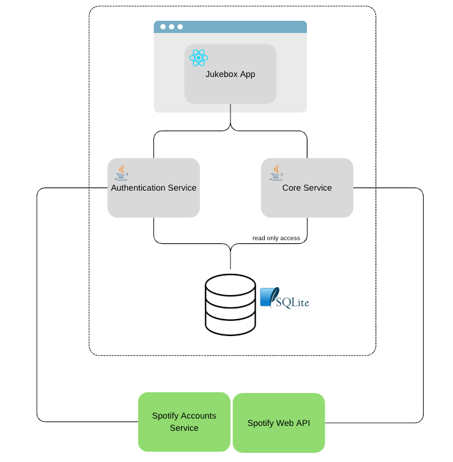
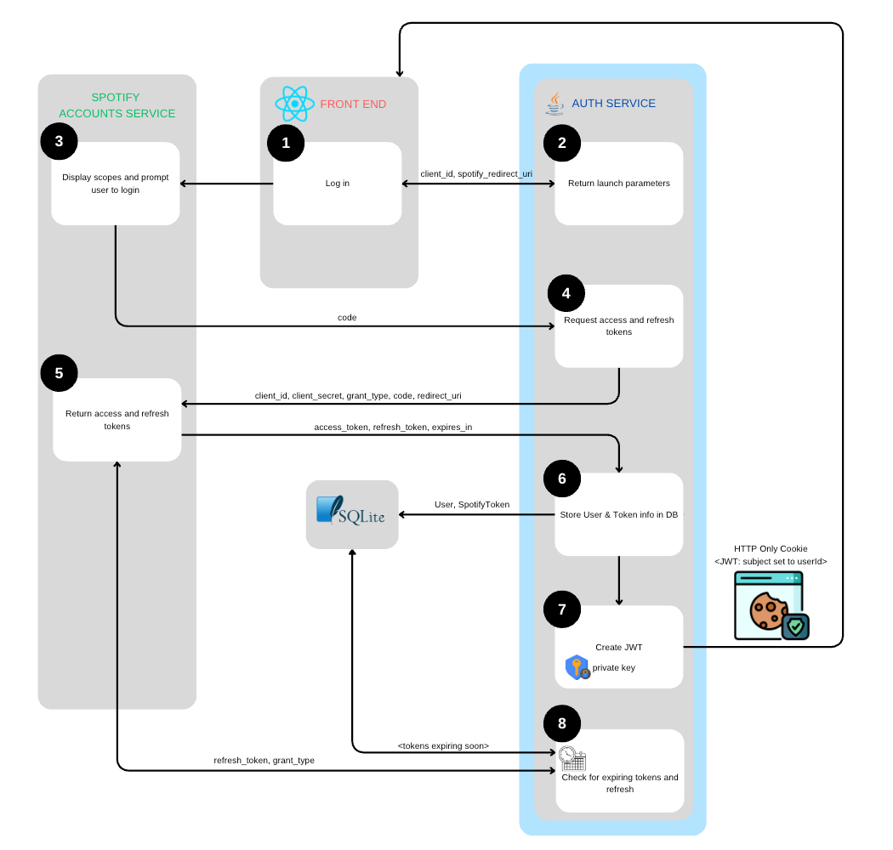
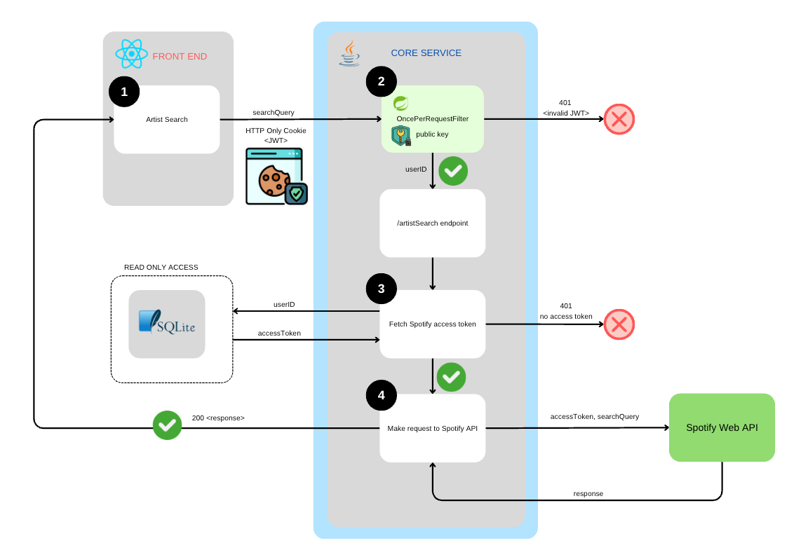

# Jukebox Authentication Service

## Overview
Spring Boot app to handle authentication flow and token management with Spotify Accounts Service.

## High-level architecture
!

## Login flow
!

## Subsequent request flow (outside of Authorisation Service)
!